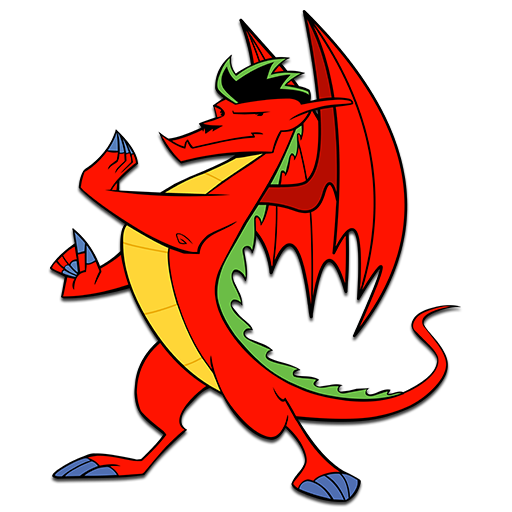
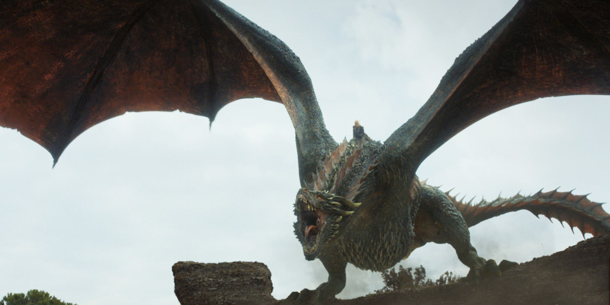

* Nadejda Boev (20056079)
* Due Date - 2022/03/09
* Github user - 16nbb1
* Github link - https://github.com/16nbb1/Biol432_A7

### Added the following dragons to Nexus file

[Ord or 75American](https://dragontales.fandom.com/wiki/Ord) From Dragon Tales created by Jim Coane & 
John Mariella


[Jake Long or 76American](https://adjl.fandom.com/wiki/Jake_Long) From American Dragon: Jake Long (Season 1) created by Jeff Goode




[Drogon or 77BritishX](https://hips.hearstapps.com/hmg-prod.s3.amazonaws.com/images/hbz-got-dany-drogon-1505228283.jpg) From Game of Thrones created by 	David Benioff, D. B. Weiss & George R. R. Martin




#### Importing all libraries we'll need

```{r}
library(ape)
library(reshape2)
library(ggplot2)
library(ggtree)
library(cowplot)
library("ggimage")
```


#### Importing Nexus file

```{r}
DragonNexus<-read.nexus.data("Input/DragonMatrix_NB.nex")
#head(DragonNexus)

# I see my inputs ("75American" "76American" "77BritishX") have been included
names(DragonNexus)
```

#### We're going to build a tree by applying the weights provided

```{r}
WeightsDat<-read.csv("Input/Weights.csv")
```

#### We need to find the weight for each encoding

```{r}
Weights<-paste0(WeightsDat$Weight,collapse="")
Weights<-strsplit(Weights,split="")[[1]]
```

#### We need to convert the above letters into values
- This loop checks if the Weight is a number of a letter
  - If the weight is a letter, +1 is added based on the alphabet values, ex. A has a value of 10

```{r}
WeightsNum<-rep(NA,length(Weights))
for(i in 1:length(WeightsNum)){
  if(Weights[i] %in% LETTERS){
    WeightsNum[i]<-which(LETTERS==Weights[i])+9
  } else {
    WeightsNum[i]<-Weights[i]
  }
}
(WeightsNum<-as.numeric(WeightsNum))
```

#### Now we need to apply these weights to each dragon, this technically represents evolutionary "importance" / conservation
- This loop through our nexus file and adds  RepWeight based on the above list (WeightsNum) in order

```{r}
WtDragonNexus<-DragonNexus # Make a new weighted data frame object
for (i in 1:length(DragonNexus)){
  RepWeight<-DragonNexus[[i]]==1
  WtDragonNexus[[i]][RepWeight]<-WeightsNum[RepWeight]
  RepWeight<-NA
}
```

#### We can now appropriately create a distance matrix, which includes our weightings
- We are calculating Euclidian distance for each dragon pairing

```{r}
# We create dataframe/matrix that will hold all the weights for each dragon
WtDragonNexusDF<-data.frame(matrix(unlist(WtDragonNexus),ncol=78,byrow=T))
# Pulls the name of the feature
row.names(WtDragonNexusDF)<-names(WtDragonNexus)
# Calculates distance with weights included
WtDragonDist<-dist(WtDragonNexusDF,method='euclidean')

# This creates a matrix which houses all the comparisons
  # Notice, all diagonal values are 0 since we're comparing the same dragon to itself (no distance/ difference)
WtDragonDistMat<-as.matrix(WtDragonDist)

# Since we we'll use ggtree/ggplot, we need to melt this matrix to be "long", where values hold all the euclidian distances
(WtPDat<-melt(WtDragonDistMat))
```
#### Visualizing the distance matrices
- Sanity check there are values with varying distances and the diagonals are 0

```{r}
(ggplot(data = WtPDat, aes(x=Var1, y=Var2, fill=value)) + 
  geom_tile()+scale_fill_gradientn(colours=c("white","blue","green","red")) +
  theme(axis.text.x = element_text(angle = 90, hjust = 1, vjust = 0.5)))
```

#### We'll begin with making a basic tree which includes names and nodes
- We'll print it to find where our 3 dragons lie

```{r}
WtDragonTree<-fastme.bal(WtDragonDist)

ggtree(WtDragonTree)+
  geom_tiplab(align=TRUE,) +
    xlim(0, 100)+
  geom_text(aes(label=node), hjust=-.3)

# ggsave("images/test.pdf", width = 50, height = 50, units = "cm", limitsize = FALSE)
```

Using the above 
- Ord (75American) is a node 15, part of internal node 97
- Jake Long (76American) is a node 16, part of internal node 97
- Drogon (77BritishX) is a node 17, part of internal node 97


#### I will group and color node 97 and add a background image of a dragon

```{r}
WtDragonTree_2 <- groupClade(WtDragonTree, c(97))

tree = ggtree(WtDragonTree_2, aes(color=group))+
  scale_color_manual(values=c("black", 'blue'))+
  geom_tiplab(align=TRUE,) +
    xlim(0, 100) +
  theme(legend.position="none")+
  geom_phylopic(image="79ad5f09-cf21-4c89-8e7d-0c82a00ce728", size=Inf, alpha=.5, color='firebrick')

ggdraw(add_sub(tree, size =10,
               'Figure 1. Phylogenetic tree of Dragons based on features and evolutionary weights. Dragons in blue are new additions')) 
  
ggsave("images/final.pdf", width = 50, height = 100, units = "cm", limitsize = FALSE)
```


### Appendix A: How I encoded features

1. Ord
  - Number of Appendanges = 4 = 1001
  - Mass = 1-2x human	= 0011
  - Body type	= Rotund = 00
  - Claw type	=Short Catlike	=1000
  - Dorsal ridges	=Ridge=010100
  - Ear morphology = Absent=000
  - Eye morphology =Avg=000
  - Eye position =Forward=1
  - Horn type	=Absent=000
  - Nose Position	=Forward=1
  - Nasal morphology =Upturned=1
  - Skin-dorsal	=Scaly Skin	=100000
  - Skin-head	=Smooth Skin=110000
  - Skin-ventral =Rough Skin=101000
  - Snout type = Blunt=1000
  - Tail type	= Blunt/Point	=10
  - Teeth	=Fangs Only	=0011
  - Toes-opposing	= No=1
  - Toe Number = Three=111000
  - Tongue length	=?
  - Tongue morphology	=??
  - Ventral plates =Yes=1
  - Whiskers =Absent=00
  - Wing structure=Hybrid=10
  - Wing type = Bird=010
2. Jake Long
  - Number of Appendanges = 4 = 1001
  - Mass = 1-2x human	= 0011
  - Body type	= Elongate = 01
  - Claw type	=Short Catlike	=1000
  - Dorsal ridges	=Spike=011000
  - Ear morphology = Spearlike=010
  - Eye morphology =Narrow=010
  - Eye position =Forward=1
  - Horn type	=Absent=000
  - Nose Position	=Forward=1
  - Nasal morphology =other=0
  - Skin-dorsal	=Smooth Skin=110000
  - Skin-head	=Hairy=000110
  - Skin-ventral =Rough Skin=101000
  - Snout type = Blunt=1000
  - Tail type	= Blunt/Point	=10
  - Teeth	= ????
  - Toes-opposing	= No=1
  - Toe Number = Four=110000
  - Tongue length	=?
  - Tongue morphology	=??
  - Ventral plates =Yes=1
  - Whiskers =Absent=00
  - Wing structure=Full=11
  - Wing type = Bat=100
3. Drogon
  - Number of Appendanges = Two = 1101
  - Mass = >4x human	= 1111
  - Body type	= Elongate = 01
  - Claw type	= Long Talons	= 0011
  - Dorsal ridges	=Spike=011000
  - Ear morphology = ???
  - Eye morphology =Small=100
  - Eye position =Lateral=0
  - Horn type	=Med/Long	=110
  - Nose Position	=Forward=1
  - Nasal morphology =other=0
  - Skin-dorsal	=Scaly Skin	=100000
  - Skin-head	=Scaly Skin	=100000
  - Skin-ventral =Scaly Skin	=100000
  - Snout type = Moderate=1100
  - Tail type	= Blunt/Point	=10
  - Teeth	=Pointy Only	=0000
  - Toes-opposing	= No=1
  - Toe Number = Three=111000
  - Tongue length	=Short=0
  - Tongue morphology	=Spear=10
  - Ventral plates =No=0
  - Whiskers =Absent=00
  - Wing structure=Full=11
  - Wing type = Bat=100


